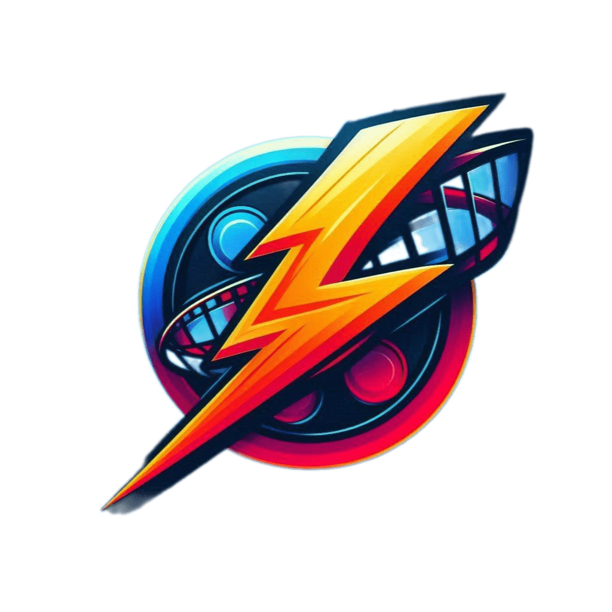
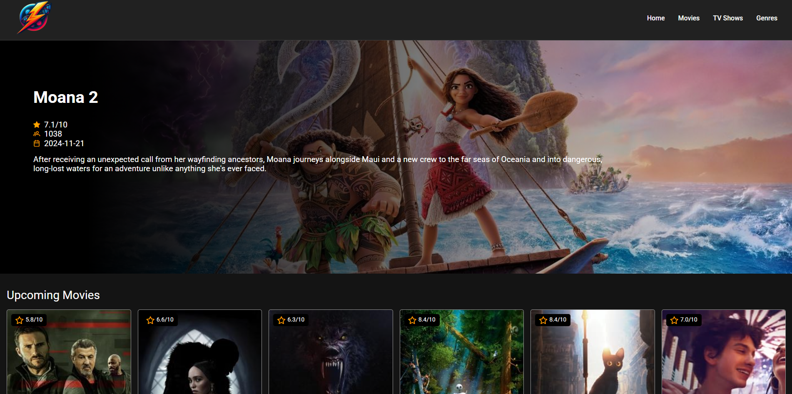
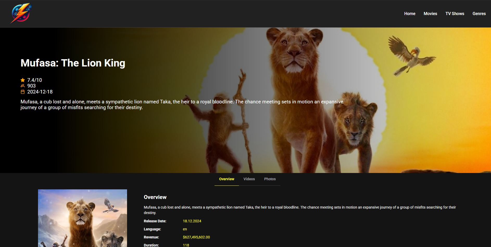
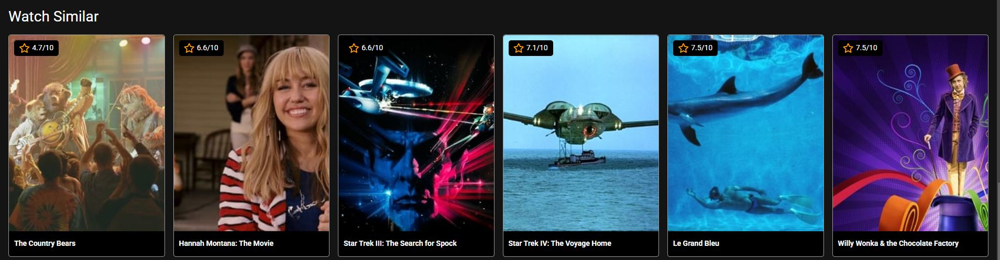
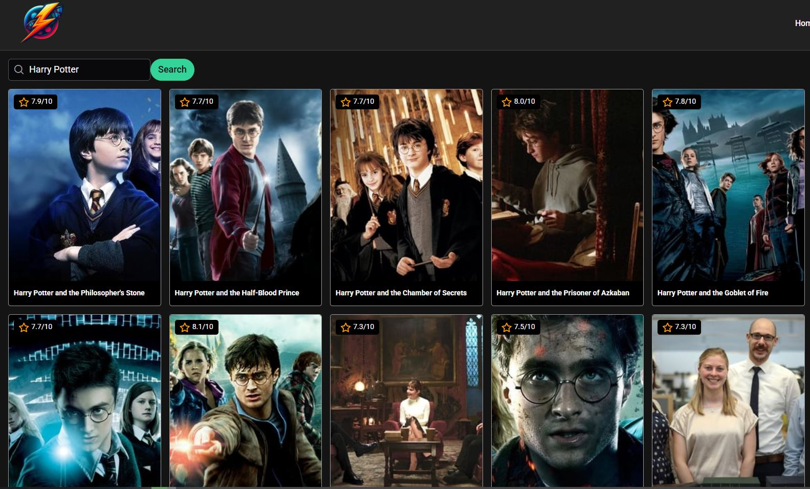
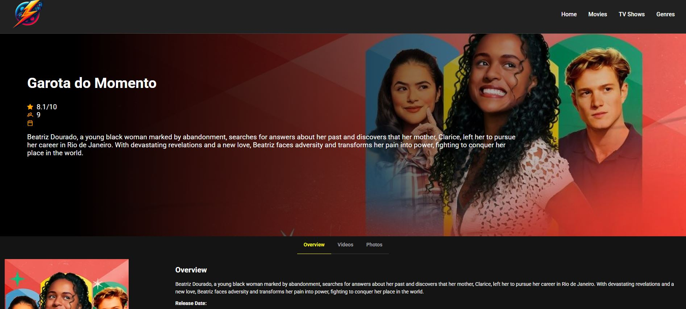
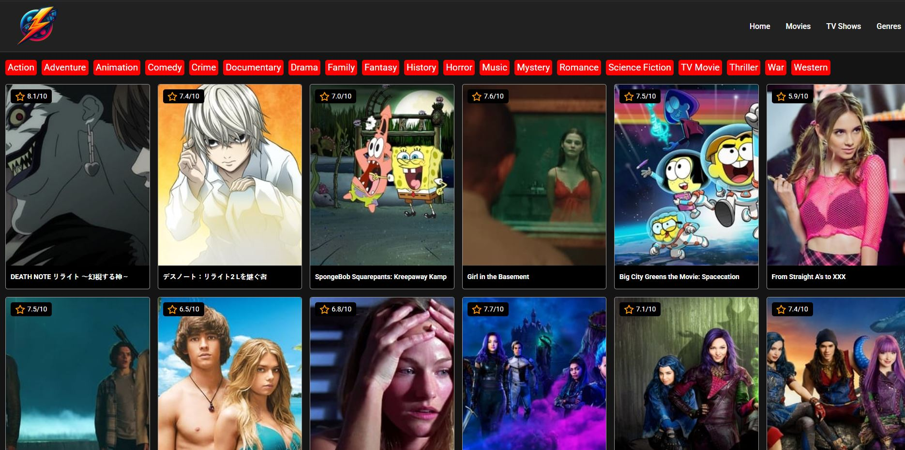

# ThunderStream
<div align="center">
  
</div>

ThunderStream is a dynamic Angular-based application that leverages the [TMDB API](https://www.themoviedb.org/) to provide users with an exceptional movie and TV show browsing experience. Explore content sorted into categories like Animated, Comedy, and Drama with ease.

## Features

- **Category Browsing**: Seamlessly browse content organized into categories: **Animated**, **Comedy**, and **Drama**.
- **Movie and TV Show Details**: Access detailed information about your favorite movies and TV shows, including descriptions, ratings, and more.
- **Search Functionality**: Quickly find movies or shows by title.
- **Responsive Design**: Optimized for viewing on desktops, tablets, and mobile devices.

## Technologies Used

- **Angular**: Framework for building the application.
- **TMDB API**: Source for movie and TV show data.
- **HTML5 & CSS3**: For structure and styling.
- **TypeScript**: For enhanced JavaScript functionality and maintainability.

## Installation

To run ThunderStream locally, follow these steps:

1. Clone the repository:
   ```bash
   git clone <repository-url>
   ```
2. Navigate to the project directory:
   ```bash
   cd thunderstream
   ```
3. Install dependencies:
   ```bash
   npm install
   ```
4. Run the development server:
   ```bash
   ng serve
   ```
5. Open your browser and visit:
   ```
   http://localhost:4200
   ```

## Screenshots

### Home Page


### Movie Details


## Watch Similar


### Search Functionality


## TV Details


## Categories Page


## TMDB API Integration
This application integrates with the TMDB API to fetch real-time data for movies and TV shows. To use the TMDB API, create an account at [TMDB](https://www.themoviedb.org/) and generate an API key.

## License

This project is licensed under the MIT License. See the LICENSE file for more information.

---

Enjoy browsing your favorite movies and TV shows on **ThunderStream**! Feel free to contribute by submitting issues or pull requests.

